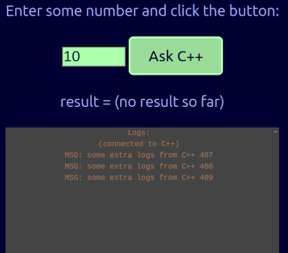

# C++ with WebUI

This repository **demonstrates how to create a C++ backend** software working together with a **Javascript frontend**.

This is a very simple and ad-hoc solution without any claim to completeness regarding the possibilities to communicate or other possible solutions to the problem.

This repository does not discuss possibilities to encode/decode messages (marshall/unmarshall, serialize/deserialize). Instead of using some sophisticated data representation (like JSON or [MessagePack](https://msgpack.org/)) and a schema (like [JSON Schema](https://json-schema.org/)) together with some code generation (like [Quicktype](https://quicktype.io/)), we just transfer raw strings or binary blobs in this example.

## Use Case (what is this good for?)

When implementing a network-only C++ data processing software (data-in, data-out), you can provide an easy to use command API with a nice UI to control you software and to interact with it.

You could also do some number crunching in C++ and provide a network API for a software written in another language (like Typescript, Java, C# or Python) implementing the computationally less critical logic.

## How to run/explore

(Tested with ubuntu; node 20, cmake, g++, developer boost libraries installed)

* You need node 20 for the frontend and a C++ compiler with cmake.
* Run `./build-and-run.sh`, it
  * compiles the webui (node, Typescript)
  * compiles the backend (cmake, C++)
  * runs the backend (which serves the webui and offers a simple API)
* Once the backend runs, open the indicated URL [`http://0.0.0.0:18080`](http://0.0.0.0:18080).
* The browser shows an page where
  * you can enter a number an trigger an action on C++ (the result is send back to the browser and is displayed).
  * you should see some logs ("some extra logs from C++ <num>" with increasing numbers).



**WebUI**: When pressing the button, Typescript request some C++ computation (`compute1/<number>`):

```ts
  const data = await fetch(
      `http://${host}:${port}/compute1/${someNumber}`
    )
    .then((x) => x.json());
```

**Backend**: Then, the following C++ code executed:

```cpp
  CROW_ROUTE(app, "/compute1/<int>")
  ([](int x) {
    CROW_LOG_INFO << "...returning 2 x " << x;
    crow::json::wvalue res({{"result", 2 * x}});
    return res;
  });
```

## Details

The manual fronend code is about 120 LOC (including HTML and CSS via Svelte). The C++ code about 90 LOC.

### C++ Backend

* Dependencies: C++20, Crow
* main entry point: [main.cpp](./backend/main.cpp)
  * serves the UI (see: [CMakeLists.txt](./backend/CMakeLists.txt), where `CROW_STATIC_DIRECTORY` points to the folder, where the WebUI is compiled to)
  * offers the URL `/compute1/<int>` to trigger a HTTP-GET command.
  * offers a WebSocket at `/logs` to provide the crow logs to the WebUI

### WebUI

Note: to get full vscode support while editing you should open this folder in an own vscode instance. You can `npm run dev` and connect to a separately running C++ backend.

* Dependencies: Typescript, Svelte 5
* main entry point: [Simple.svelte](./ui/src/lib/Simple.svelte)
  * renders a UI
  * allows to enter a number, allow to press a button to send a command (HTTP-GET) to C++ and display the answer from C++.
  * connects to the WebSocket server from C++ and shows all logs.
